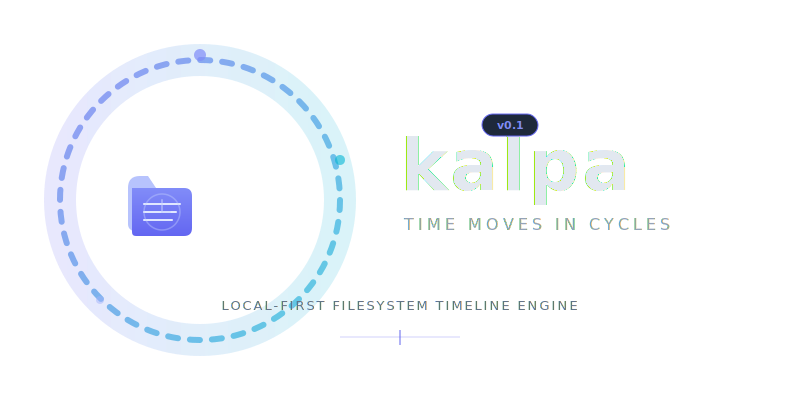

<p align="center">
  
</p>

<p align="center">
  <a href="https://github.com/swadhinbiswas/kalpa/actions/workflows/ci.yml"></a>
  <a href="https://pypi.org/project/kalpa/"></a>
  <a href="https://pypi.org/project/kalpa/"></a>
  <a href="LICENSE"></a>
  <a href="https://github.com/astral-sh/ruff"></a>
  <a href="https://github.com/swadhinbiswas/kalpa"></a>
</p>

<p align="center"><b>Local-first filesystem timeline engine.</b><br>
Watch any folder. Undo anything. Replay your project's history.<br>
Fork old states into parallel workspaces.</p>

<p align="center"><i>No Git. No cloud. No config. Just time.</i></p>

<br>

<p align="center">
  
</p>

<br>

## Viral Demo (60 seconds)

```bash
# Start watching
kalpa watch ./my-project --background

# Do some work
echo "def authenticate(): pass" > src/auth.py
echo "server started" >> src/main.py

# OH NO — accidentally deleted src/
rm -rf src/

# The "holy shit" moment — restore instantly
kalpa undo
# → Restored: 1 file (0.0 KB)
# → src/auth.py

# The "wow" moment — watch history unfold
kalpa timeline
# → +19:15:11  create  src/auth.py · 30B
# → ~19:15:12  modify  src/main.py · 45B
# → -19:15:14  delete  src/auth.py

# Watch it grow like a timelapse
kalpa replay --speed 3x

# The mind-bending moment — fork the past
kalpa fork --from "1 hour ago"
ls
# → my-project/    my-project_fork_1023/
```

## Install

```bash
pip install kalpa
```

With TUI support:

```bash
pip install "kalpa[ui]"
```

## Quickstart

```bash
# Start watching a folder
kalpa watch ./my-project

# View the timeline
kalpa timeline

# Undo the last destructive change
kalpa undo

# Watch your project grow like a timelapse
kalpa replay --speed 3x

# Fork the folder as it was 2 hours ago
kalpa fork --from "2 hours ago"

# Diff between two points in time
kalpa diff "2 hours ago" "now"

# Check watch status
kalpa status

# Create a manual snapshot
kalpa snapshot --label "checkpoint"

# Stop watching
kalpa stop ./my-project
```

## Commands

| Command | Description |
|---|---|
| `kalpa watch <folder>` | Start tracking filesystem changes |
| `kalpa stop <folder>` | Stop watching a folder |
| `kalpa status` | Show watch state and stats |
| `kalpa timeline` | View event history |
| `kalpa replay` | Animated history playback |
| `kalpa undo` | Restore last destructive change |
| `kalpa fork --from <time>` | Create parallel folder at past state |
| `kalpa diff <timeA> <timeB>` | Cross-time folder diff |
| `kalpa snapshot` | Take manual full snapshot |

## Time Expressions

All time arguments support natural language:

| Expression | Example |
|---|---|
| Relative | `"5 minutes ago"`, `"2 hours ago"`, `"1 day ago"` |
| Future | `"in 1 hour"` |
| Named | `"now"`, `"today"`, `"yesterday"` |
| With clock | `"yesterday 6pm"`, `"today 9am"` |
| Absolute | `"2025-01-14 08:00:00"`, `"2025-01-14"` |

## Why Kalpa?

Because `rm -rf` shouldn't be permanent. Because watching a project grow
from nothing is magical. Because sometimes you need to go back — not to a
commit, but to a moment.

## Architecture

```
kalpa/
├── cli/              typer-based CLI (9 commands)
├── watcher/          watchdog file monitoring
├── snapshot_engine/  incremental delta snapshots (zstd)
├── storage/          SQLite + zstd compression
├── replay_engine/    timeline reconstruction
├── fork_engine/      folder materialization
├── diff_engine/      cross-time comparison
├── timeline/         event query layer
└── ui/               Textual TUI + rich output
```

## Development

```bash
git clone https://github.com/swadhinbiswas/kalpa
cd kalpa
uv venv && source .venv/bin/activate
uv pip install -e ".[dev]"
pytest tests/
```

## License

MIT — see [LICENSE](LICENSE).
